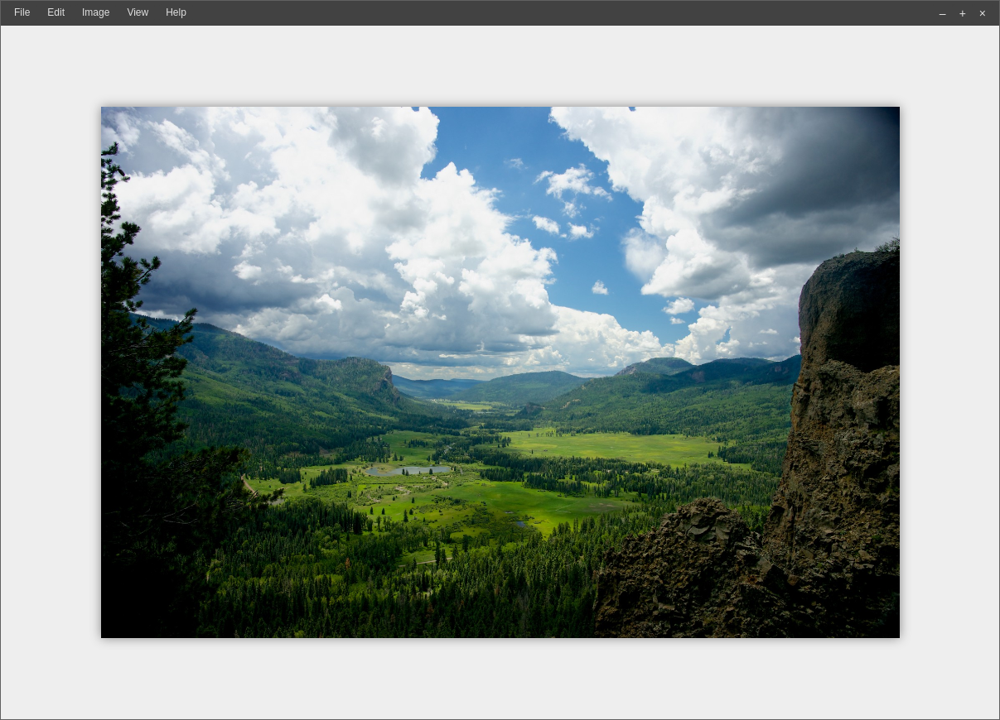

# rhino

Rhino Editor is an image editor specifically targetted towards Linux.

Linux has a history of very poor image editors. Gimp (while some may disagree)
is difficult to use because it is different from every other editor. Photoshop,
Paint.NET and other editors are not available for Linux. Other editors for linux
exist but they are often commercial and closed source.

Rhino Editor is a free (forever) and open source image editor specifically
targetted towards Linux. It may be possible to use its technologies on other
platforms, but it is primarily aimed to work on most popular Linux
distributions. If a platform dependent decision must be made, Linux
compatibility will always be favored over anything else.



## Usage

Make sure you have [Node.js](https://nodejs.org/en/) and
[Rust](https://www.rust-lang.org/) installed on your computer.

You may need to install yarn with `npm install -g yarn`

```bash
yarn
# Run these in two separate terminal tabs
yarn run dev
yarn start
```

You may need to press Ctrl+R if the dev server has not finished loading yet.

## Image Worker Process

We use a separate image worker process that performs all
image operations. It can be found in `image-worker/` and
its usage is documented in [`image-worker/README.md`](image-worker/README.md).
